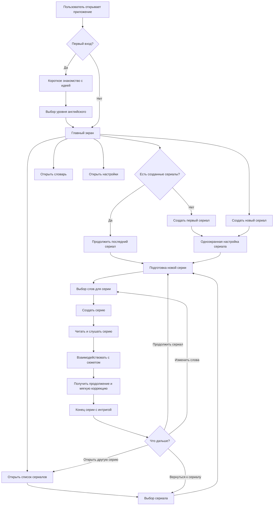
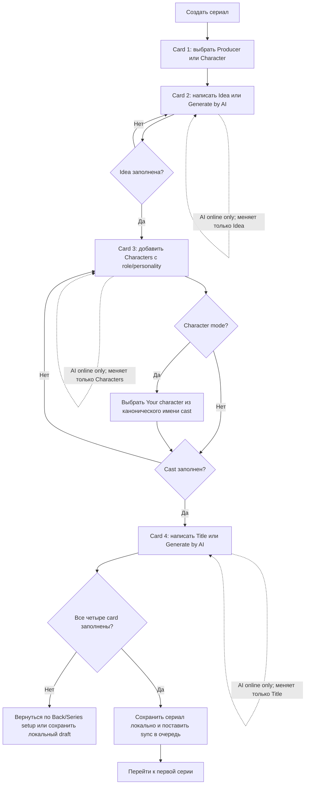
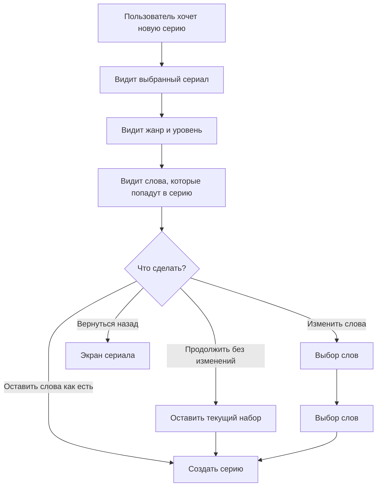
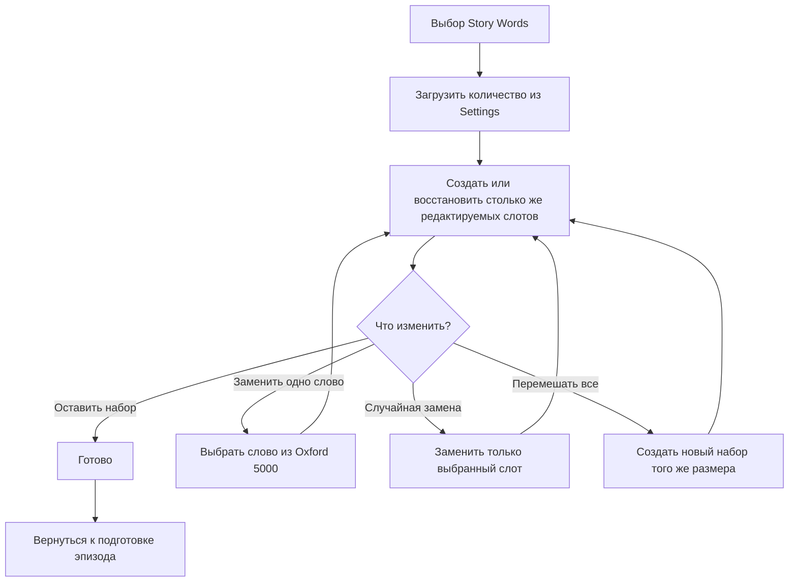
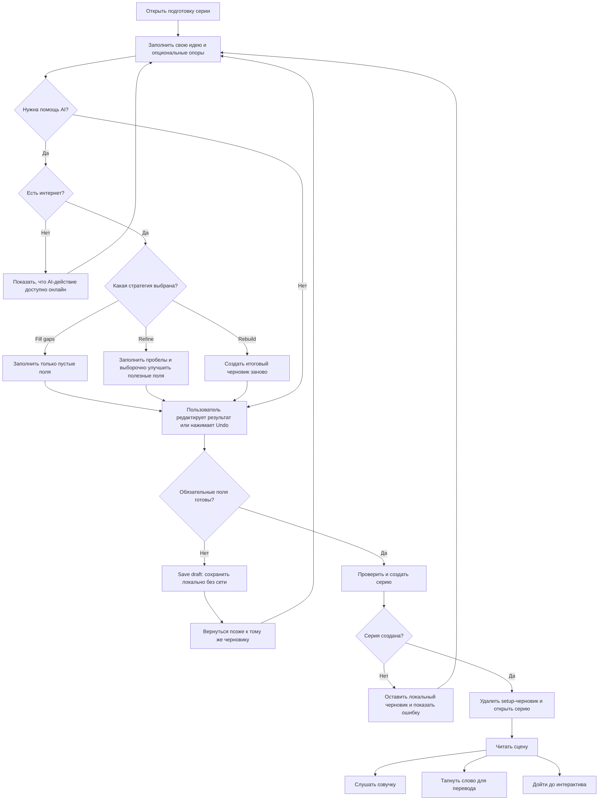
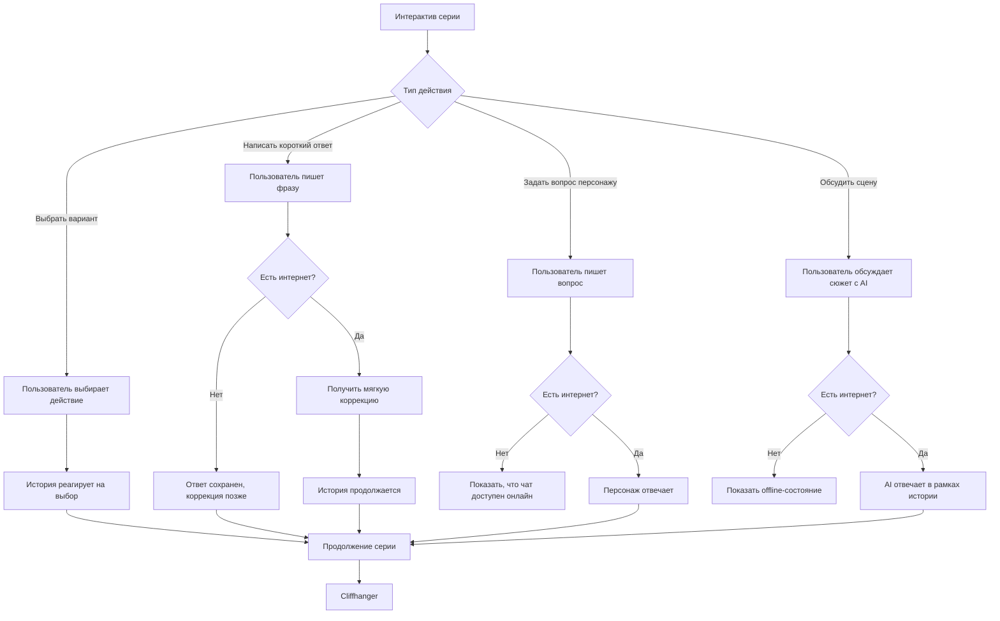
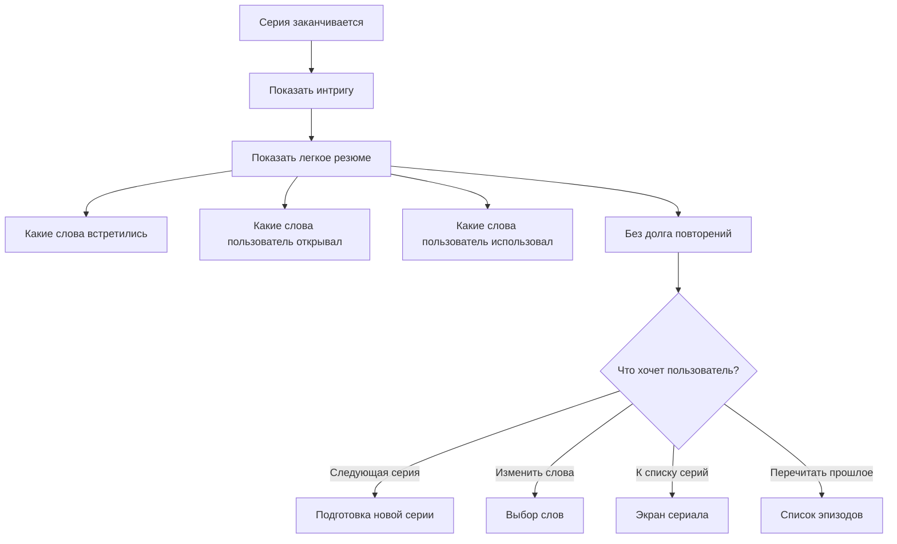
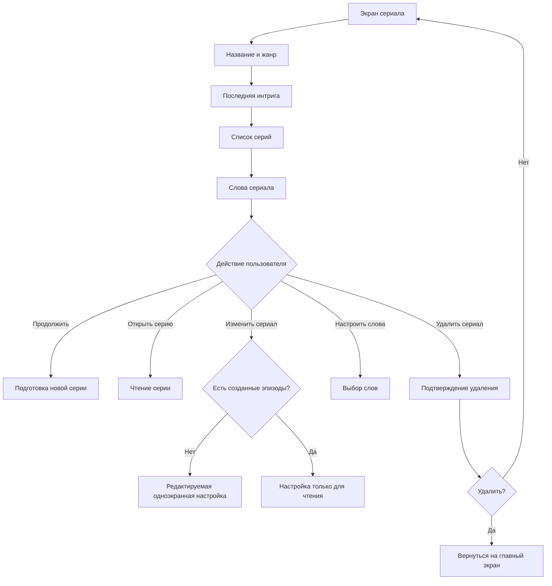
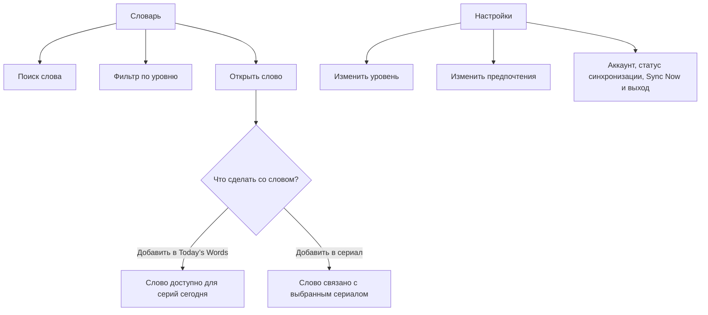
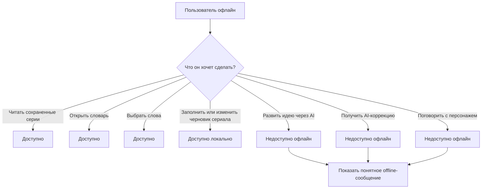

# User Flow Visual Schema — Context-English Series MVP

## 1. Общая Карта Пользовательского Пути

## 2. Создание Сериала

## 3. Подготовка Серии

## 4. Выбор Слов Для Серии

## 5. Подготовка, Создание И Чтение Серии

## 6. Интерактив Внутри Серии

## 7. Конец Серии

## 8. Экран Сериала

## 9. Словарь И Настройки

## 10. Offline Ветвления

